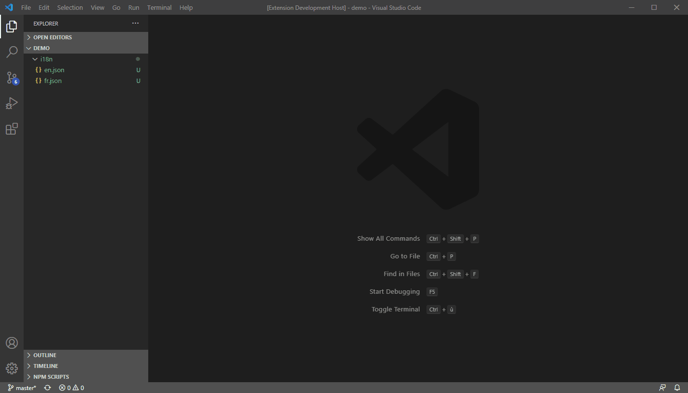
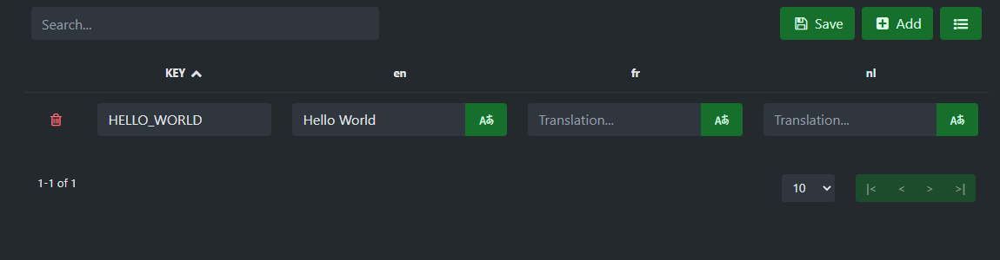

# i18n-l10n-editor


i18n-l10n-editor is a Visual Studio Code extension to easily edit your i18n and l10n translations files.

## Usage

i18n-l10n-editor can be used in two ways :

- Click the **i18n/l10n Button on the status bar. This will search for any l10n.yaml file and then open the translations from these files.

- Right click on a folder named **i18n** or **l10n** and select : **i18n/l10n Editor** <br>
    _Folder name can be changed with <ins>i18n-l10n-editor.supportedFolders</ins>_<br><br> 

- Within a workspace you can edit several folders at the same time. Click on **i18n/l10n editor** presents in the Status Bar <br>
    _<ins>i18n-l10n-editor.workspaceFolders</ins> must be set_<br><br> 

<br><br>

- To use a translation service defined : <br>
    _<ins>i18n-l10n-editor.translationService</ins> and <ins>i18n-l10n-editor.translationServiceApiKey</ins>_<br><br> 

## Configuration

- **i18n-l10n-editor.forceKeyUPPERCASE** : Force the keys to uppercase (default : true)

```json
  "i18n-l10n-editor.forceKeyUPPERCASE": false
```

- **i18n-l10n-editor.jsonSpace** : A String or Number that's used to insert white space into the output JSON (default : 2) <br>
    _For more information, have a look on the JSON.stringify() method._

```json
  "i18n-l10n-editor.jsonSpace": 5
```

- **i18n-l10n-editor.lineEnding** : String used to signify the end of a line (default : "\n")

```json
  "i18n-l10n-editor.lineEnding": "\r\n"
```

- **i18n-l10n-editor.keySeparator** : String to separate keys, or false if no separator is preferred (default : ".")

```json
    "i18n-l10n-editor.keySeparator": "/"
```

- **i18n-l10n-editor.supportedFolders** : An array of folder names that's used to open the extension through the right click (default : ["i18n"]) <br> _<ins>Restart Visual Studio Code</ins> after changing the value_

```json
    "i18n-l10n-editor.supportedFolders": [
        "i18n",
        "locales"
    ]
```

- **i18n-l10n-editor.translationService** : Specified wich translation service to use (Only Microsoft translator is currently available)

```json
  "i18n-l10n-editor.translationService" : "MicrosoftTranslator"
```

- **i18n-l10n-editor.translationServiceApiKey** : Api key used by the translation service

```json
  "i18n-l10n-editor.translationServiceApiKey": "**********"
```

- **i18n-l10n-editor.workspaceFolders** : An array of objects to specify which folders are used to manage your translations

```json
  "i18n-l10n-editor.workspaceFolders": [
    { "name": "Common", "path": "./i18n" },
    { "name": "Portal", "path": "./portal/locales" }
  ]
```

## Author

**Vanderseypen Thibault** ([https://vanderseypen.dev](https://vanderseypen.dev))
